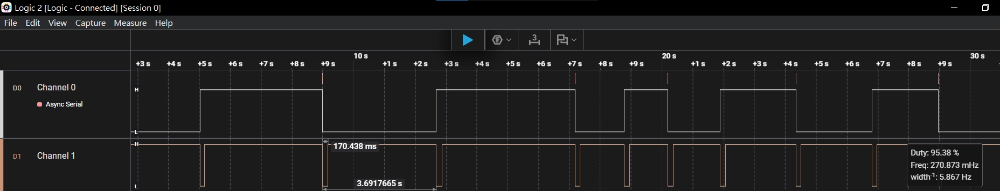
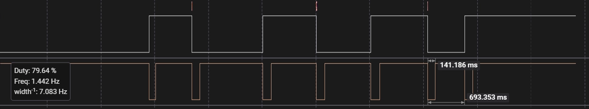
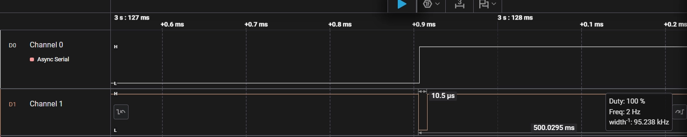

# Day 5：中斷實戰 — Interrupt Latency Measurement

## 📊 實驗結果總覽

| 實驗 | 觸發源 | 延遲 | 根因 |
|---|---|---|---|
| 初始測試 | 機械按鈕 BUTTON1 | ~170ms | 機械彈跳 + Mbed OS Debounce |
| 禁止 Deep Sleep | 機械按鈕 BUTTON1 | ~141ms | 縮短喚醒時間，但彈跳仍存在 |
| Loopback Test | 數位訊號 D2→D3 | < 50µs | 純硬體中斷，無物理彈跳 |

**結論**：硬體中斷本身反應在 µs 等級，170ms 延遲來自機械彈跳與 OS 軟體濾波，非中斷機制本身的問題。

## 🔍 根因分析

- **機械彈跳 (Bounce)**：按鈕按下瞬間產生數十 ms 電壓雜訊，Mbed OS InterruptIn 內建軟體濾波等待訊號穩定
- **Deep Sleep 喚醒**：禁止 Deep Sleep 後延遲從 170ms 降至 141ms，證明 OS 喚醒時鐘穩定需要額外時間
- **Loopback 驗證**：改用 D2 數位輸出觸發 D3 中斷，排除機械因素，延遲降至 µs 等級

## 📁 檔案結構
Day05_Interrupt/

├── main.cpp              # Loopback Test 版本
├── Core/
│   ├── Inc/
│   │   └── exti_control.h
│   └── Src/
│       └── exti_control.cpp

## 🌊 波形截圖

| 測試 | 波形 |
|---|---|
| 170ms（機械按鈕） |  |
| 141ms（禁止 Deep Sleep） |  |
| < 50µs（Loopback） |  |

## 💡 學到的關鍵概念

| 概念 | 說明 |
|---|---|
| `InterruptIn` | 硬體中斷輸入，事件驅動取代 Polling |
| Deep Sleep vs Sleep | Deep Sleep 省電但喚醒慢，Sleep 保持時鐘隨時待命 |
| `wait_us()` vs `sleep_for()` | 前者忙碌等待（精確），後者交還 RTOS 調度（省電） |
| Loopback Test | 排除外部變數，驗證系統內部行為的標準方法 |
| 機械彈跳 (Debounce) | 硬體解法：並聯 0.1µF 電容；軟體解法：延遲過濾 |

## 🔗 PSU 韌體應用連結

此實驗對應伺服器電源供應器（PSU）韌體中的 **OVP/OCP 中斷保護**：
電源異常 → 硬體觸發中斷 → µs 內關閉 PWM 輸出 → 保護電路

→ Phase 2 將實作 ADC 取樣 + PWM 控制，與此中斷機制整合