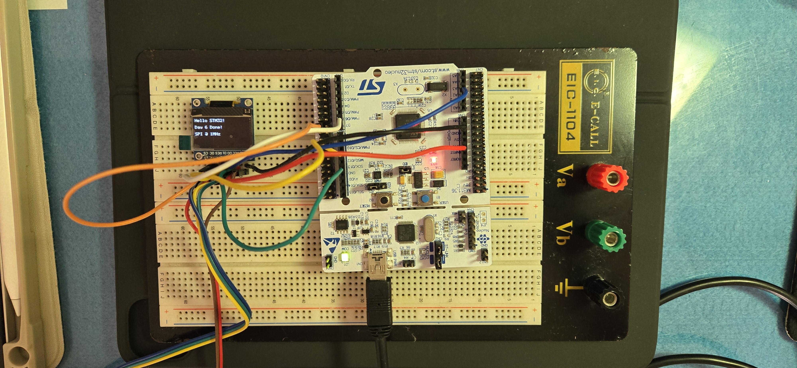

# Day 6：SPI 周邊驅動 — SSD1306 OLED 文字顯示

## 📊 實作總覽

| 項目 | 內容 |
| --- | --- |
| 通訊介面 | SPI（4-wire，多一條獨立 D/C 腳位區分指令/資料） |
| 顯示晶片 | SSD1306（128×64，單色 OLED） |
| 傳輸速率 | 1 MHz（保守設定：杜邦線飛線，訊號品質有限，datasheet 上限是 10MHz） |
| 實作功能 | 硬體重置、初始化序列、清屏、5×7 點陣字型繪製、字串輸出 |
| 遇到的問題 | 字型陣列查表越界（off-by-one），顯示不支援字元時會讀到陣列外的記憶體 |

**結論**：這天的重點不是「量測」，而是照著 SSD1306 datasheet 從零寫一份完整驅動——從沒有任何現成函式庫開始，理解一顆顯示 IC 真正需要哪些初始化步驟才會亮。

## 🔍 根因分析：字型陣列越界

`font5x7[][5]` 只定義了 `0x20`（空白）到 `0x7A`（`'z'`）共 91 個字元，用 `font5x7[c - 0x20]` 直接查表：

```cpp
void oled_draw_char(char c, uint8_t col, uint8_t page) {
    if (c < 0x20 || c > 0x7A) c = ' ';  // 邊界檢查：0x7B（'{'）以上就超出字型表範圍
    ...
    const uint8_t* glyph = font5x7[c - 0x20];
    ...
}
```

- **問題**：一開始沒有上界檢查，如果 `main.cpp` 印出 `'{'`（`0x7B`）之類的字元，`c - 0x20` 算出來的索引就落在陣列外，讀到的是記憶體裡其他變數的資料，OLED 上會顯示出莫名其妙的亂碼圖案，而不是當機或編譯錯誤——這種「悄悄讀到別的記憶體」的 bug 最難抓，因為程式不會報錯。
- **修法**：查表前先夾住合法範圍 `[0x20, 0x7A]`，超出範圍一律當空白處理。
- **跟前面幾天的連結**：這其實跟 Day 3 的機械彈跳、Day 4 的 UART framing 是同一種思維——**先假設輸入會超出預期，再收斂處理**，只是這次的「輸入」是字元、「防呆」是陣列邊界檢查，而不是電氣訊號。

## 📁 檔案結構

```
Day06_OLED_SPI/
├── main.cpp
├── Core/
│   ├── Inc/
│   │   └── oled_ssd1306.h
│   └── Src/
│       └── oled_ssd1306.cpp
```

## 🖥 顯示畫面

實機接線與 OLED 實際輸出（128×64，三行文字，跟 `main.cpp` 內容逐字對應）：



## 💡 學到的關鍵概念

| 概念 | 說明 |
| --- | --- |
| SPI 4-wire 協定 | MOSI/SCLK/CS + 獨立的 D/C 腳位；只寫不讀，所以 MISO 接 `NC` |
| D/C 腳位 | 同一條資料線靠 D/C 高低區分「這個 byte 是指令」還是「這個 byte 是像素資料」 |
| SSD1306 初始化序列 | Datasheet 規定的固定順序：關閉顯示 → 設定定址模式與範圍 → 開啟 Charge Pump（面板供電）→ 設定對比度 → 開啟顯示 |
| Framebuffer Paging | 128×64 螢幕切成 8 個 page，每個 page 高 8px，一個 byte 控制垂直方向 8 個像素 |
| 點陣字型 (Bitmap Font) | 5×7 字型用 5 個 byte 描述一個字元的直欄圖案，逐欄寫入 GDDRAM |
| 陣列邊界檢查 | 查表前先夾住合法索引範圍，避免存取越界記憶體（悄悄讀到別的變數，不會報錯） |

## 🔗 與其他 Day / 專案的連結

- **← Day 4**：延續「模組化封裝」風格，OLED 驅動同樣拆成 `.h` 介面 + `.cpp` 實作，`main.cpp` 只呼叫 `oled_init()` / `oled_draw_string()` 等高階 API，不直接碰 SPI 暫存器細節。
- **→ Phase 2**：這顆 OLED 之後可以當作電源供應器（PSU）的**本地狀態顯示螢幕**——不用接電腦，直接在板子上即時顯示 Day 7 ADC 量到的電壓/電流數值，方便現場除錯。
